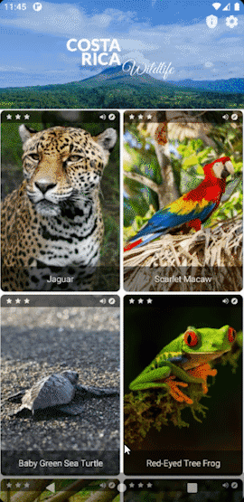
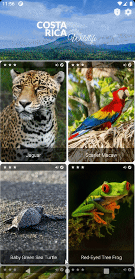
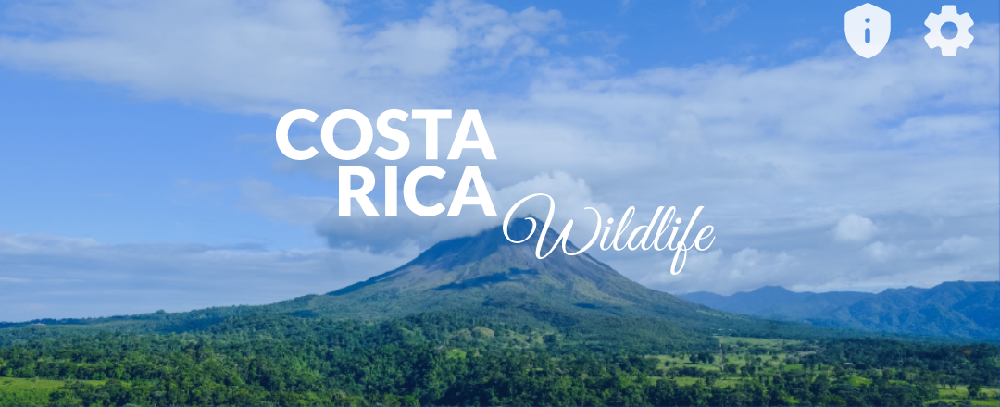
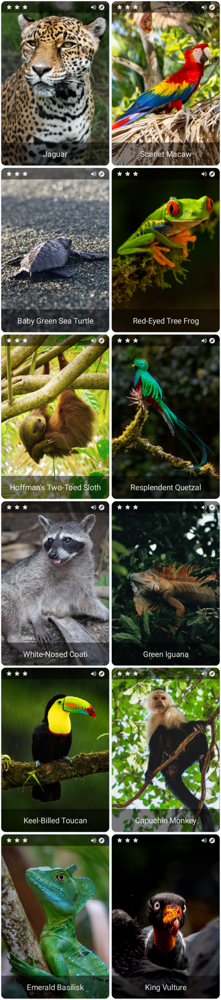

# CollapsingToolbarInCompose

  
  
  
  
  
  

## Branches

- `master`: Initial code.
- `column_version`: Resulting code using a `Column`.
- `lazycolumn_version`: Resulting code using a `LazyColumn`.

## Description

This is a native Android application whose UI is completely implemented in <a href="https://developer.android.com/jetpack/compose" target="_blank">Jetpack Compose</a>. It replicates the functionality of a *Coordinator Layout* and displays a list of items with a collapsing toolbar on top that behaves differently depending on its scroll flag.

This project is part of a programming guide published on *Medium* that shows how to implement a collapsing toolbar in <a href="https://developer.android.com/jetpack/compose" target="_blank">Jetpack Compose</a> which can be found <a href="https://medium.com/kotlin-and-kotlin-for-android/collapsing-toolbar-in-jetpack-compose-problem-solutions-and-alternatives-34c9c5986ea0" target="_blank">here</a>.

## Purpose

The main purpose is to show how to implement the same functionality of a *Coordinator Layout* built 100% in <a href="https://developer.android.com/jetpack/compose" target="_blank">Jetpack Compose</a>. In order to do so, 4 out of its 5 different behaviors/scroll flags are implemented:

Scroll behavior

The toolbar acts like if it were attached to the top of the list. When the list is scrolled down, the toolbar gets collapsed and leaves the screen before the first element does. When the list is scrolled up, once the first element is completely shown, the toolbar enters the screen and gets expanded.

EnterAlways behavior

As soon as the list is scrolled down, no matter its current position or scroll state, the toolbar gets collapsed and leaves the screen. When the list is scrolled up, the toolbar enters the screen immediately and gets expanded.

EnterAlwaysCollapsed behavior

As soon as the list is scrolled down, no matter its current position or scroll state, the toolbar gets collapsed and leaves the screen. When the list is scrolled up, the toolbar enters the screen immediately, but it only gets expanded if the first element is being shown completely.

ExitUntilCollapsed behavior

In this case, the toolbar never leaves the screen. As soon as the list is scrolled down, no matter its current position or scroll state, the toolbar gets collapsed. When the list is scrolled up, the toolbar gets expanded only if the first element is being shown completely.

## Theme
The application is titled ***Costa Rica Wildlife*** and shows a list of exotic animals that can be found across this country.

<b>Expanded Toolbar Preview</b>

 

<b>Collapsed Toolbar Preview</b>

 

<b>Sample List Preview</b>

---

### Photo Credits
- <a href="https://unsplash.com/photos/AL8LzIpl7YI" target="_blank">Arenal Volcano</a> by <a href="https://unsplash.com/@fabiofistarol" target="_blank">[Fabio Fistarol]</a>
- <a href="https://unsplash.com/photos/QIktihNFiYY" target="_blank">Jaguar</a> by <a href="https://unsplash.com/@menaomar" target="_blank">[Omar Mena]</a>
- <a href="https://unsplash.com/photos/h1blzO2YTtA" target="_blank">Scarlet Macaw</a> by <a href="https://unsplash.com/@photoskunk" target="_blank">[Shannon Kunkle]</a>
- <a href="https://unsplash.com/photos/TmvZsBPA494" target="_blank">Baby Green Sea Turtle</a> by <a href="https://unsplash.com/@charlotterush19" target="_blank">[Charlotte Rush]</a>
- <a href="https://unsplash.com/photos/HYTwWSE5ztw" target="_blank">Red-Eyed Tree Frog</a> by <a href="https://unsplash.com/@zmachacek" target="_blank">[Zdeněk Macháček]</a>
- <a href="https://unsplash.com/photos/-TvZ6VB915M" target="_blank">Hoffman's Two-Toed Sloth</a> by <a href="https://unsplash.com/@adrianvalverdem" target="_blank">[Adrián Valverde]</a>
- <a href="https://unsplash.com/photos/yeqt115Xkeg" target="_blank">Resplendent Quetzal</a> by <a href="https://unsplash.com/@zmachacek" target="_blank">[Zdeněk Macháček]</a>
- <a href="https://unsplash.com/photos/UWxAjQuZiyA" target="_blank">White-Nosed Coati</a> by <a href="https://unsplash.com/@frksk" target="_blank">[Frank Williams]</a>
- <a href="https://unsplash.com/photos/zX6X-6AUYhk" target="_blank">Green Iguana</a> by <a href="https://unsplash.com/@oopsdidisayalli" target="_blank">[Alli Elder]</a>
- <a href="https://unsplash.com/photos/uDp75nEotL0" target="_blank">Keel-Billed Toucan</a> by <a href="https://unsplash.com/@zmachacek" target="_blank">[Zdeněk Macháček]</a>
- <a href="https://unsplash.com/photos/NZpl4yxYcMg" target="_blank">Capuchin Monkey</a> by <a href="https://unsplash.com/@etiennedelorieux" target="_blank">[Etienne Delorieux]</a>
- <a href="https://unsplash.com/photos/ZYl1GvRslWc" target="_blank">Emerald Basilisk</a> by <a href="https://unsplash.com/@raymondo600" target="_blank">[Ray Harrington]</a>
- <a href="https://unsplash.com/photos/uHk1QUAgLJM" target="_blank">King Vulture</a> by <a href="https://unsplash.com/@bist31" target="_blank">[Birger Strahl]</a>
